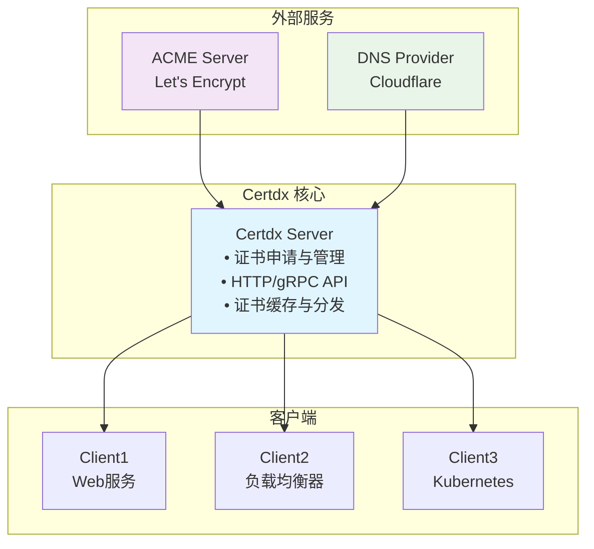

# 1. 快速入门指南

## 1.1 Certdx 是什么

Certdx（Certificate Daemon eXtended）是一款**集中式 SSL 证书管理系统**，专为解决传统证书管理的痛点而设计：

### 传统方式的主要问题
- **分散管理**：每台服务器各自申请和维护证书，运维成本高
- **手动操作**：人工续期易出错，服务中断风险大
- **扩展困难**：新增服务器需重复配置，微服务环境下复杂度激增

### Certdx 的创新方案
- **🎯 集中化管理**：一台中心服务器统一管理所有证书
- **⚡ 全自动流程**：证书自动申请、续期、分发，无需人工干预
- **🔌 丰富生态集成**：支持多种 Web 服务器与 Kubernetes 生态

### 核心价值
1. **大幅降低运维成本**：将 N 台服务器的证书管理简化为 1 台中心服务器
2. **显著提升可靠性**：自动化流程减少人为失误，保障服务连续性
3. **增强安全性**：统一证书策略与安全配置，风险可控

## 1.2 系统架构



### 核心组件

**📡 Certdx Server（证书服务器）**
- 与 ACME 服务器通信，集中申请和管理证书
- 提供 HTTP 与 gRPC API
- 实现证书缓存、续期策略与分发机制

**📱 Certdx Client（证书客户端）**
- 部署于需要证书的服务器
- 向 Certdx Server 请求并获取证书
- 自动部署证书到本地文件系统

**🔌 生态集成**
- **Caddy 插件**：无缝集成 Caddy Web 服务器
- **Kubernetes ClusterIssuer**：兼容 cert-manager 工作流

## 1.3 15 分钟快速体验

### 环境准备

开始之前，请确保您具备以下条件：

**必需条件**：
- Linux/macOS/Windows 系统
- 一个您拥有的域名（如 `example.com`）
- Cloudflare 账号（推荐，也可使用其他 DNS 提供商）

**网络要求**：
- 服务器能访问互联网
- 防火墙开放端口：`19198`（HTTP API）

### 步骤 1：安装 Certdx

#### 方法一：下载预编译二进制文件（推荐）

```bash
# 创建工作目录
mkdir -p /opt/certdx/{config,logs,certs}
cd /opt/certdx

# 下载最新版本
wget https://github.com/ParaParty/certdx/releases/latest/download/certdx_linux_amd64.zip

# 解压文件
unzip certdx_linux_amd64.zip
chmod +x certdx_linux_amd64

# 创建符号链接
ln -s certdx_linux_amd64 certdx_server
ln -s certdx_linux_amd64 certdx_client
```

#### 方法二：Docker 部署

```bash
# 创建配置目录
mkdir -p /opt/certdx/{config,data,logs}

# 使用 Docker Compose
cat > docker-compose.yml << 'EOF'
version: '3.8'
services:
  certdx-server:
    image: certdx/certdx-server:latest
    container_name: certdx-server
    restart: unless-stopped
    ports:
      - "19198:19198"
    volumes:
      - ./config:/app/config
      - ./data:/app/data
      - ./logs:/app/logs
    environment:
      - CERTDX_CONFIG_FILE=/app/config/server.toml
EOF

# 启动服务
docker-compose up -d
```

#### 方法三：源码编译

```bash
# 安装 Go 1.19+
wget https://go.dev/dl/go1.21.0.linux-amd64.tar.gz
sudo tar -C /usr/local -xzf go1.21.0.linux-amd64.tar.gz
export PATH=$PATH:/usr/local/go/bin

# 克隆并编译
git clone https://github.com/ParaParty/certdx.git
cd certdx
go mod download
make build-all
sudo make install
```

### 步骤 2：配置服务端

创建服务端配置文件：

```bash
cat > /opt/certdx/config/server.toml << 'EOF'
[ACME]
# 您的邮箱地址，用于ACME账号注册
email = "admin@yourdomain.com"
# 使用Let's Encrypt生产环境
provider = "r3"
# 允许申请证书的根域名
allowedDomains = ["yourdomain.com"]

[DnsProvider]
# 使用Cloudflare DNS验证
type = "cloudflare"
# 您的Cloudflare API Token（需要Zone:Edit权限）
authToken = "your-cloudflare-api-token"

[HttpServer]
enabled = true
listen = ":19198"
apiPath = "/api"
secure = true
# 服务器自己的域名，用于HTTPS API
names = ["certdx.yourdomain.com"]
# API访问令牌
token = "your-secure-api-token"
EOF
```

**⚠️ 重要配置说明**：

1. **邮箱地址**: 替换为您的真实邮箱
2. **域名设置**: 将 `yourdomain.com` 替换为您的域名
3. **Cloudflare 配置**: 
   - 登录 Cloudflare 控制台 → "我的配置" → "API 令牌"
   - 创建令牌，权限选择 "Zone:Edit"
   - 复制令牌到配置文件
4. **安全令牌**: 生成一个安全的随机字符串

### 步骤 3：配置 DNS 记录

在 Cloudflare 中添加 A 记录：

```
类型: A
名称: certdx  
内容: 您的服务器IP
TTL: 自动
```

### 步骤 4：启动服务端

```bash
cd /opt/certdx

# 启动服务端
./certdx_server --conf config/server.toml --log logs/server.log --debug
```

您应该看到类似输出：
```
2024/01/01 10:00:00 Starting certdx server v1.0.0
2024/01/01 10:00:00 ACME client initialized for provider: r3
2024/01/01 10:00:00 HTTP server listening on :19198
2024/01/01 10:00:00 Server started successfully
```

### 步骤 5：配置和启动客户端

新开一个终端，配置客户端：

```bash
cd /opt/certdx

cat > config/client.toml << 'EOF'
[Http.MainServer]
url = "https://certdx.yourdomain.com:19198/api"
token = "your-secure-api-token"

[[Certifications]]
name = "my-first-cert"
savePath = "/opt/certdx/certs"
domains = [
    "test.yourdomain.com",
    "api.yourdomain.com",
]
# 证书更新后重载服务（可选）
# reloadCommand = "nginx -s reload"
EOF

# 启动客户端
./certdx_client --conf config/client.toml --log logs/client.log --debug
```

### 步骤 6：验证证书申请

如果一切配置正确，您应该看到：

**服务端日志**：
```
2024/01/01 10:01:00 New certificate request for domains: [test.yourdomain.com api.yourdomain.com]
2024/01/01 10:01:30 DNS challenge completed successfully
2024/01/01 10:01:35 Certificate issued successfully
```

**客户端日志**：
```
2024/01/01 10:01:35 Certificate received and saved to /opt/certdx/certs/my-first-cert.pem
2024/01/01 10:01:35 Private key saved to /opt/certdx/certs/my-first-cert.key
```

**验证证书文件**：
```bash
ls -la /opt/certdx/certs/
# 应该看到证书文件

# 查看证书详情
openssl x509 -in /opt/certdx/certs/my-first-cert.pem -text -noout | grep -A2 "Subject Alternative Name"
```

## 1.4 生产环境部署

### 系统要求

| 组件 | 最低配置 | 推荐配置 | 备注 |
|------|----------|----------|------|
| **Certdx Server** | 1 核 CPU, 512MB 内存 | 2 核 CPU, 2GB 内存 | 证书数量多时需更多资源 |
| **Certdx Client** | 0.1 核 CPU, 64MB 内存 | 0.2 核 CPU, 128MB 内存 | 轻量级客户端 |
| **磁盘空间** | 100MB | 1GB | 用于证书存储和日志 |

### 创建系统服务

**1. 创建专用用户**

```bash
sudo useradd --system --shell /sbin/nologin certdx
sudo mkdir -p /etc/certdx/{server,client}
sudo mkdir -p /var/lib/certdx/{data,certs}
sudo mkdir -p /var/log/certdx
sudo chown -R certdx:certdx /etc/certdx /var/lib/certdx /var/log/certdx
```

**2. 创建 Systemd 服务**

服务端服务文件 `/etc/systemd/system/certdx-server.service`：

```ini
[Unit]
Description=Certdx Certificate Server
Documentation=https://certdx.org/docs
After=network-online.target
Wants=network-online.target

[Service]
Type=simple
User=certdx
Group=certdx
ExecStart=/usr/local/bin/certdx-server -config /etc/certdx/server/config.toml
ExecReload=/bin/kill -HUP $MAINPID
Restart=always
RestartSec=10
StandardOutput=journal
StandardError=journal

# 安全设置
NoNewPrivileges=true
PrivateTmp=true
ProtectSystem=strict
ProtectHome=true
ReadWritePaths=/var/lib/certdx /var/log/certdx

[Install]
WantedBy=multi-user.target
```

客户端服务文件 `/etc/systemd/system/certdx-client.service`：

```ini
[Unit]
Description=Certdx Certificate Client
Documentation=https://certdx.org/docs
After=network-online.target certdx-server.service
Wants=network-online.target

[Service]
Type=simple
User=certdx
Group=certdx
ExecStart=/usr/local/bin/certdx-client -config /etc/certdx/client/config.toml
Restart=always
RestartSec=30
StandardOutput=journal
StandardError=journal

[Install]
WantedBy=multi-user.target
```

**3. 启动和管理服务**

```bash
# 重载 systemd 配置
sudo systemctl daemon-reload

# 启用并启动服务
sudo systemctl enable certdx-server certdx-client
sudo systemctl start certdx-server certdx-client

# 检查服务状态
sudo systemctl status certdx-server
sudo systemctl status certdx-client

# 查看日志
sudo journalctl -u certdx-server -f
sudo journalctl -u certdx-client -f
```

### 部署验证

```bash
# 检查服务健康状态
curl -k https://certdx.yourdomain.com:19198/health

# 测试 API 连通性
curl -k -H "Authorization: Bearer your-token" \
     https://certdx.yourdomain.com:19198/api/v1/certificates

# 手动触发证书申请测试
certdx-client -config /etc/certdx/client/config.toml -test-domain test.yourdomain.com
```

## 1.5 典型应用场景

### 🏢 企业多服务器环境

**场景**：企业拥有多台 Web 服务器，需为不同域名配置 SSL 证书。

**Certdx 解决方案**：
- 1 台 Certdx Server 统一管理所有证书申请与续期
- N 台服务器运行 Certdx Client 自动获取证书
- 运维工作量从 O(N) 降低到 O(1)

### 🐳 微服务/Kubernetes 环境

**场景**：容器化微服务架构，服务数量多且变化频繁。

**Certdx 解决方案**：
```yaml
apiVersion: cert-manager.io/v1
kind: ClusterIssuer
metadata:
  name: certdx-issuer
spec:
  certdx:
    server: https://certdx.internal:19198
    token: "secure-token"
```

**效果**：证书申请与分发全自动，支持服务弹性扩容。

---

## 小结

通过本指南，您已经：
- ✅ 了解了 Certdx 的核心价值和架构
- ✅ 完成了 15 分钟快速体验
- ✅ 掌握了生产环境部署流程
- ✅ 了解了典型应用场景

**下一步**：查看 [配置指南](02-configuration-guide.md)，深入了解详细配置选项。 