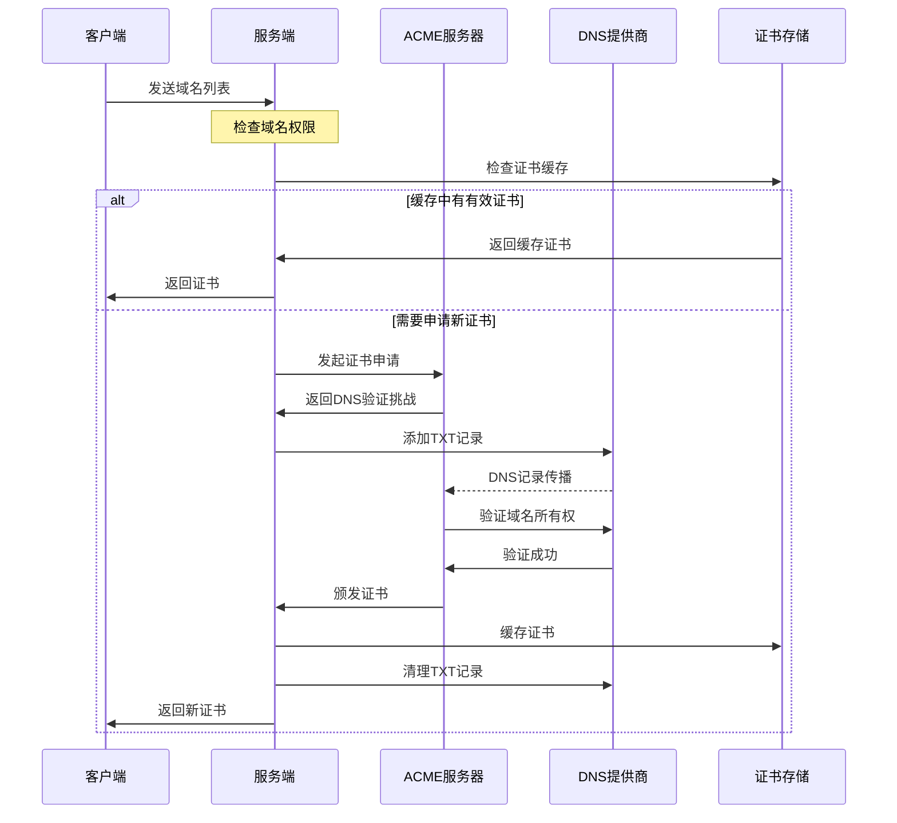
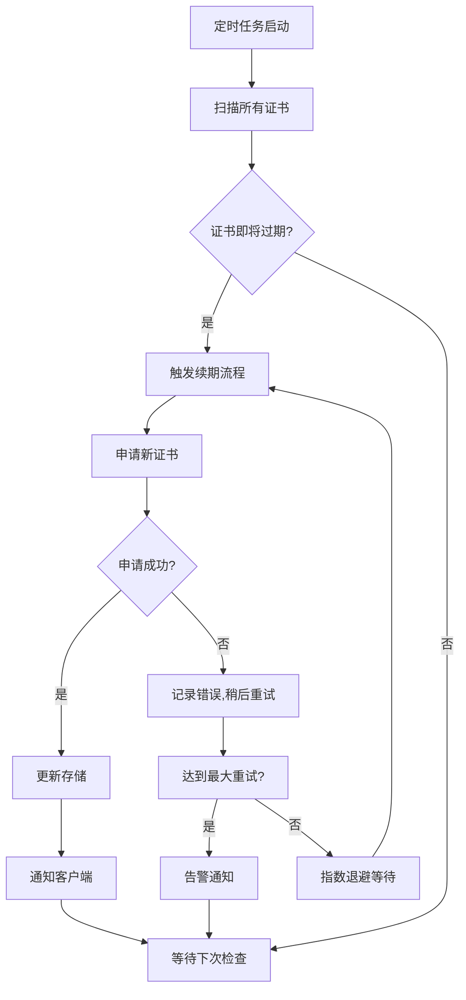

# 3. 运维指南

本指南提供 Certdx 系统的深度架构解析、日常运维管理、监控告警配置、故障排除和最佳实践。

## 3.1 架构深度解析

### 系统整体架构

```
                    ┌─────────────────────────────────────┐
                    │           外部服务依赖               │
                    └─────────────────────────────────────┘
                                       │
    ┌─────────────────┐    ┌─────────────────┐    ┌─────────────────┐
    │   ACME服务器     │    │   DNS提供商      │    │   存储后端       │
    │                │    │                │    │                │
    │ • Let's Encrypt │    │ • Cloudflare   │    │ • S3兼容存储     │
    │ • Google CA     │    │ • 腾讯云DNS     │    │ • 本地文件       │
    │ • ZeroSSL       │    │ • AWS Route53  │    │ • 其他对象存储    │
    └─────────┬───────┘    └─────────┬───────┘    └─────────┬───────┘
              │                      │                      │
              └──────────────────────┼──────────────────────┘
                                     │
                        ┌─────────────▼─────────────┐
                        │       Certdx Server      │
                        │                          │
                        │  ┌─────────────────────┐ │
                        │  │    ACME Manager     │ │  ───┐
                        │  │ • 证书申请与管理     │ │     │ 核心
                        │  │ • 生命周期管理       │ │     │ 服务
                        │  │ • 自动续期策略       │ │     │ 层
                        │  └─────────────────────┘ │  ───┘
                        │                          │
                        │  ┌─────────────────────┐ │
                        │  │   Certificate Store │ │  ───┐
                        │  │ • 证书缓存管理       │ │     │ 存储
                        │  │ • 安全密钥存储       │ │     │ 管理
                        │  │ • 元数据管理         │ │     │ 层
                        │  └─────────────────────┘ │  ───┘
                        │                          │
                        │  ┌─────────────────────┐ │
                        │  │    API Gateway      │ │  ───┐
                        │  │ • HTTP/gRPC API     │ │     │ 接口
                        │  │ • 认证与授权         │ │     │ 服务
                        │  │ • 负载均衡           │ │     │ 层
                        │  └─────────────────────┘ │  ───┘
                        └─────────────┬─────────────┘
                                      │
                 ┌────────────────────┼────────────────────┐
                 │                   │                    │
            ┌────▼────┐         ┌─────▼─────┐      ┌──────▼──────┐
            │ Client1 │         │  Client2  │      │   Client3   │
            │         │         │           │      │             │
            │Web服务器 │         │负载均衡器  │      │ Kubernetes  │
            │• Nginx  │         │• HAProxy  │      │• Ingress    │
            │• Apache │         │• Traefik  │      │• cert-mgr   │
            └─────────┘         └───────────┘      └─────────────┘
```

### 核心组件设计

#### ACME 管理器

```go
type ACMEManager struct {
    Provider     string           // ACME提供商
    Client       *lego.Client     // ACME客户端
    Account      *lego.Account    // ACME账户
    DNSProvider  challenge.Provider // DNS验证提供商
    
    // 状态管理
    rateLimiter  *rate.Limiter    // 速率限制
    retryPolicy  *RetryPolicy     // 重试策略
    healthCheck  *HealthChecker   // 健康检查
}
```

**功能特性**：
- 多种 ACME 提供商支持（Let's Encrypt、Google CA、ZeroSSL）
- 智能证书申请策略（避免重复申请）
- 自动错误重试机制
- 证书质量验证
- 速率限制保护

#### 证书存储器

```go
type CertificateStore struct {
    Cache     *CertCache          // 多级缓存
    Backend   StorageBackend      // 持久化后端
    Lock      sync.RWMutex       // 并发安全
    Indexer   *CertIndexer       // 证书索引
}

type Certificate struct {
    Domains      []string    // 域名列表
    Certificate  []byte      // 证书内容
    PrivateKey   []byte      // 私钥
    IssuedAt     time.Time   // 颁发时间
    ExpiresAt    time.Time   // 过期时间
    Checksum     string      // 校验和
    Metadata     map[string]interface{} // 元数据
}
```

**存储特性**：
- 多级缓存架构（内存 + 持久化）
- 证书完整性校验
- 安全的私钥存储
- 原子性更新操作
- 高效的证书检索

#### API 网关

```go
type APIGateway struct {
    HTTPServer   *http.Server    // HTTP API服务器
    GRPCServer   *grpc.Server    // gRPC API服务器
    Middleware   []Middleware    // 中间件链
    Auth         AuthProvider    // 认证提供商
    RateLimit    *RateLimiter    // 限流器
    Monitor      *Monitor        // 监控器
}
```

**API 特性**：
- RESTful HTTP API + gRPC API 双协议
- Token-based 认证机制
- 请求限流和熔断保护
- 详细的访问日志
- 实时性能监控

### 数据流分析

#### 证书申请流程



#### 续期检查流程



### 性能特性

#### 并发处理能力

- **服务端**：支持数千并发连接
- **客户端**：轻量级设计，单实例资源消耗极低
- **证书存储**：读写分离，支持高并发访问

#### 缓存机制

```go
type CertCache struct {
    L1Cache   *lru.Cache      // 内存缓存（热点数据）
    L2Cache   *redis.Client   // Redis缓存（可选）
    Backend   StorageBackend  // 持久化存储
}
```

- **L1 缓存**：内存 LRU 缓存，毫秒级响应
- **L2 缓存**：Redis 分布式缓存（可选）
- **持久化**：本地文件系统或 S3 兼容存储

## 3.2 监控与告警

### 指标监控

#### Prometheus 指标

服务端默认在 `/metrics` 端点暴露 Prometheus 指标：

```bash
# 检查指标端点
curl http://certdx.company.com:19198/metrics
```

**核心指标**：

| 指标名称 | 类型 | 描述 |
|----------|------|------|
| `certdx_certificates_total` | Gauge | 总证书数量 |
| `certdx_certificates_expires_soon` | Gauge | 7天内过期证书数量 |
| `certdx_certificates_expired` | Gauge | 已过期证书数量 |
| `certdx_acme_requests_total` | Counter | ACME 请求总数 |
| `certdx_acme_requests_failed` | Counter | ACME 请求失败数 |
| `certdx_api_requests_total` | Counter | API 请求总数 |
| `certdx_api_request_duration` | Histogram | API 请求延迟 |
| `certdx_dns_challenges_total` | Counter | DNS 验证总数 |
| `certdx_dns_challenges_failed` | Counter | DNS 验证失败数 |

#### Grafana 监控面板

导入预定义的 Grafana 面板：

```json
{
  "dashboard": {
    "id": null,
    "title": "Certdx Monitoring",
    "tags": ["certdx", "ssl", "certificates"],
    "timezone": "browser",
    "panels": [
      {
        "title": "证书总览",
        "type": "stat",
        "targets": [
          {
            "expr": "certdx_certificates_total",
            "legendFormat": "总证书数"
          },
          {
            "expr": "certdx_certificates_expires_soon",
            "legendFormat": "即将过期"
          }
        ]
      },
      {
        "title": "API 请求量",
        "type": "graph",
        "targets": [
          {
            "expr": "rate(certdx_api_requests_total[5m])",
            "legendFormat": "{{method}} {{status}}"
          }
        ]
      }
    ]
  }
}
```

#### 健康检查

**服务端健康检查**：
```bash
# 基础健康检查
curl http://certdx.company.com:19198/health

# 详细健康检查
curl http://certdx.company.com:19198/health?detail=true
```

返回示例：
```json
{
  "status": "healthy",
  "version": "v1.0.0",
  "uptime": "72h30m15s",
  "components": {
    "acme_client": "healthy",
    "dns_provider": "healthy",
    "storage": "healthy",
    "cache": "healthy"
  },
  "metrics": {
    "total_certificates": 45,
    "expires_soon": 2,
    "api_requests_per_minute": 12.5
  }
}
```

### 告警配置

#### Prometheus 告警规则

创建 `certdx-alerts.yml`：

```yaml
groups:
  - name: certdx
    rules:
      # 证书即将过期告警
      - alert: CertificateExpiringSoon
        expr: certdx_certificates_expires_soon > 0
        for: 0m
        labels:
          severity: warning
        annotations:
          summary: "证书即将过期"
          description: "有 {{ $value }} 个证书将在7天内过期"

      # 证书已过期告警
      - alert: CertificateExpired
        expr: certdx_certificates_expired > 0
        for: 0m
        labels:
          severity: critical
        annotations:
          summary: "证书已过期"
          description: "有 {{ $value }} 个证书已过期"

      # ACME 请求失败率高
      - alert: ACMEFailureRateHigh
        expr: rate(certdx_acme_requests_failed[5m]) / rate(certdx_acme_requests_total[5m]) > 0.1
        for: 5m
        labels:
          severity: warning
        annotations:
          summary: "ACME 请求失败率过高"
          description: "ACME 请求失败率为 {{ $value | humanizePercentage }}"

      # 服务端不可用
      - alert: CertdxServerDown
        expr: up{job="certdx"} == 0
        for: 1m
        labels:
          severity: critical
        annotations:
          summary: "Certdx 服务端不可用"
          description: "Certdx 服务端已离线超过1分钟"

      # API 延迟过高
      - alert: APILatencyHigh
        expr: histogram_quantile(0.95, rate(certdx_api_request_duration_bucket[5m])) > 1
        for: 5m
        labels:
          severity: warning
        annotations:
          summary: "API 延迟过高"
          description: "95% API 请求延迟超过 {{ $value }}s"
```

#### AlertManager 配置

```yaml
global:
  smtp_smarthost: 'smtp.company.com:587'
  smtp_from: 'certdx-alerts@company.com'

route:
  group_by: ['alertname']
  group_wait: 10s
  group_interval: 10s
  repeat_interval: 1h
  receiver: 'default'

receivers:
  - name: 'default'
    email_configs:
      - to: 'ops-team@company.com'
        subject: '[CERTDX] {{ .GroupLabels.alertname }}'
        body: |
          {{ range .Alerts }}
          告警: {{ .Annotations.summary }}
          详情: {{ .Annotations.description }}
          时间: {{ .StartsAt }}
          {{ end }}
    
    webhook_configs:
      - url: 'https://hooks.slack.com/services/YOUR/SLACK/WEBHOOK'
        send_resolved: true
        title: 'CERTDX Alert'
        text: '{{ range .Alerts }}{{ .Annotations.summary }}{{ end }}'
```

### 日志管理

#### 日志配置

```toml
# 服务端日志配置
[Logging]
level = "info"           # 日志级别: debug, info, warn, error
format = "json"          # 输出格式: text, json
output = "file"          # 输出目标: stdout, file, syslog
file = "/var/log/certdx/server.log"
maxSize = "100MB"        # 单文件最大大小
maxAge = "30d"           # 日志保留时间
maxBackups = 10          # 最大备份文件数
compress = true          # 是否压缩旧日志
```

#### 日志聚合

**使用 ELK Stack**：

```yaml
# logstash.conf
input {
  file {
    path => "/var/log/certdx/*.log"
    codec => "json"
    tags => ["certdx"]
  }
}

filter {
  if "certdx" in [tags] {
    mutate {
      add_field => { "service" => "certdx" }
    }
  }
}

output {
  elasticsearch {
    hosts => ["elasticsearch:9200"]
    index => "certdx-logs-%{+YYYY.MM.dd}"
  }
}
```

**Kibana 查询示例**：
```
# 查看错误日志
level:error AND service:certdx

# 查看证书申请记录
message:"certificate request" AND level:info

# 查看 API 访问日志
component:api_gateway AND @timestamp:[now-1h TO now]
```

## 3.3 故障排除

### 常见问题诊断

#### 问题分类

1. **配置问题** - 配置文件语法错误或参数设置不当
2. **连接问题** - 网络连接、DNS 解析、防火墙等
3. **认证问题** - API 密钥、令牌、证书认证失败
4. **权限问题** - 文件权限、系统权限不足
5. **ACME 相关问题** - Let's Encrypt 限流、验证失败等
6. **证书管理问题** - 证书申请、续期、分发失败

#### 诊断工具

**启用调试模式**：
```bash
# 服务端调试
./certdx_server --conf config/server.toml --debug --log /tmp/debug.log

# 客户端调试
./certdx_client --conf config/client.toml --debug --log /tmp/debug.log
```

**检查服务状态**：
```bash
# 检查服务端健康状态
curl -k https://certdx.company.com:19198/health

# 检查 API 可用性
curl -k -H "Authorization: Bearer your-token" \
  https://certdx.company.com:19198/api/v1/certificates

# 检查 gRPC 服务（如果启用）
grpcurl -insecure grpc-certdx.company.com:11451 list
```

**网络连通性测试**：
```bash
# 测试服务端端口
telnet certdx.company.com 19198

# 测试 DNS 解析
nslookup certdx.company.com
dig certdx.company.com

# 测试证书有效性
openssl s_client -connect certdx.company.com:19198 -servername certdx.company.com
```

### 服务端问题排除

#### 问题 1：服务启动失败

**症状**：
```
Error: failed to start server: listen tcp :19198: bind: address already in use
```

**解决方案**：
```bash
# 检查端口占用
netstat -tlnp | grep 19198
lsof -i :19198

# 杀死占用进程
kill -9 PID

# 更换端口
[HttpServer]
listen = ":19199"  # 使用其他端口

# 使用 sudo 运行（如需特权端口）
sudo ./certdx_server --conf config/server.toml
```

#### 问题 2：ACME 账号注册失败

**症状**：
```
Error: failed to register ACME account: invalid email address
Error: failed to register ACME account: rate limit exceeded
```

**解决方案**：
```bash
# 检查邮箱格式
[ACME]
email = "valid-email@company.com"

# 检查网络连接
curl -I https://acme-v02.api.letsencrypt.org/directory

# 等待速率限制重置或使用测试环境
[ACME]
provider = "r3test"

# 检查系统时间
date
ntpdate -s time.nist.gov
```

#### 问题 3：DNS 提供商认证失败

**症状**：
```
Error: failed to create DNS provider: authentication failed
Error: cloudflare: API token is invalid
```

**解决方案**：
```bash
# 验证 Cloudflare API Token
curl -X GET "https://api.cloudflare.com/client/v4/user/tokens/verify" \
  -H "Authorization: Bearer your-api-token"

# 检查 token 权限（需要 Zone:Zone:Read 和 Zone:DNS:Edit）

# 验证腾讯云密钥
tccli configure list
tccli dnspod DescribeDomainList

# 检查配置格式
[DnsProvider]
type = "cloudflare"
authToken = "your-token-without-quotes-or-spaces"
```

#### 问题 4：证书申请失败

**症状**：
```
Error: failed to obtain certificate: DNS challenge failed
Error: domain not allowed: test.example.com
```

**解决方案**：
```bash
# 检查域名配置
[ACME]
allowedDomains = [
    "example.com",  # 确保包含根域名
]

# 手动测试 DNS 验证
dig _acme-challenge.example.com TXT

# 检查 DNS 传播
# 等待 DNS 记录传播（通常1-5分钟）
# 或禁用完整传播检查
[DnsProvider]
disableCompletePropagationRequirement = true

# 检查域名解析
nslookup example.com

# 检查 Let's Encrypt 速率限制
# 查看 https://letsencrypt.org/docs/rate-limits/
# 如果触发限制，等待一周或使用测试环境
```

### 客户端问题排除

#### 问题 1：无法连接服务端

**症状**：
```
Error: failed to connect to server: dial tcp: lookup certdx.company.com: no such host
Error: failed to connect to server: connection refused
Error: failed to connect to server: certificate verify failed
```

**解决方案**：
```bash
# 检查 DNS 解析
nslookup certdx.company.com
echo "1.2.3.4 certdx.company.com" >> /etc/hosts  # 临时解决

# 检查网络连通性
ping certdx.company.com
telnet certdx.company.com 19198

# 验证证书
openssl s_client -connect certdx.company.com:19198 -servername certdx.company.com

# 跳过证书验证（仅用于测试）
[Http.MainServer]
insecureSkipVerify = true

# 检查代理设置
export http_proxy=""
export https_proxy=""
```

#### 问题 2：认证失败

**症状**：
```
Error: authentication failed: invalid token
Error: HTTP 401 Unauthorized
```

**解决方案**：
```bash
# 检查 token 配置
[Http.MainServer]
token = "correct-token-from-server-config"

# 手动测试 API 认证
curl -H "Authorization: Bearer your-token" \
     https://certdx.company.com:19198/api/v1/health

# 检查服务端 token 配置
[HttpServer]
token = "same-token-as-client"
```

#### 问题 3：证书文件权限问题

**症状**：
```
Error: failed to write certificate file: permission denied
Error: failed to reload service: permission denied
```

**解决方案**：
```bash
# 检查目录权限
ls -la /etc/ssl/certs/
sudo chown certdx:certdx /etc/ssl/certs/
sudo chmod 755 /etc/ssl/certs/

# 检查文件权限
chmod 600 /etc/ssl/certs/*.key
chmod 644 /etc/ssl/certs/*.crt

# 检查 reload 命令权限
# 为 certdx 用户添加 sudo 权限
echo "certdx ALL=(ALL) NOPASSWD: /usr/bin/systemctl reload nginx" >> /etc/sudoers.d/certdx

# 或使用专门的脚本
[[Certifications]]
reloadCommand = "/opt/scripts/reload-nginx.sh"
```

### 性能问题排除

#### 内存使用过高

```bash
# 检查内存使用
ps aux | grep certdx
top -p $(pgrep certdx)

# 调整缓存大小
[Cache]
maxEntries = 500  # 减少缓存条目数
ttl = "30m"       # 减少缓存TTL

# 启用垃圾回收调优
export GOGC=100
export GOMEMLIMIT=512MiB
```

#### API 响应慢

```bash
# 检查网络延迟
curl -w "%{time_total}\n" -o /dev/null -s https://certdx.company.com:19198/health

# 检查服务端负载
htop
iostat -x 1

# 调整超时设置
[HttpServer]
readTimeout = "10s"
writeTimeout = "10s"

# 启用 HTTP/2
[HttpServer]
enableHTTP2 = true
```

### 应急处理

#### 证书紧急续期

```bash
# 手动强制续期
./certdx_client --conf config/client.toml --force-renew

# 临时禁用证书验证
[Http.MainServer]
insecureSkipVerify = true

# 使用备用服务器
[Http.StandbyServer]
url = "https://certdx-backup.company.com:19198/api"
token = "backup-token"
```

#### 服务紧急恢复

```bash
# 快速启动容器
docker run -d --name certdx-emergency \
  -p 19198:19198 \
  -v /emergency/config:/app/config \
  certdx/certdx-server:latest

# 数据库恢复
cp /backup/certdx-data.db /var/lib/certdx/data/
chown certdx:certdx /var/lib/certdx/data/certdx-data.db
systemctl restart certdx-server
```

## 3.4 最佳实践

### 安全最佳实践

#### 1. 认证与授权

```toml
# 使用强随机令牌
[HttpServer]
token = "$(openssl rand -base64 32)"

# 启用客户端证书验证
requireClientCert = true
clientCAs = ["/etc/ssl/ca/client-ca.pem"]

# 限制 API 访问
allowOrigins = ["https://admin.company.com"]
rateLimitPerSecond = 10
```

#### 2. 网络安全

```bash
# 使用防火墙限制访问
iptables -A INPUT -p tcp --dport 19198 -s 10.0.0.0/8 -j ACCEPT
iptables -A INPUT -p tcp --dport 19198 -j DROP

# 使用 VPN 或内网访问
[Http.MainServer]
url = "https://certdx.internal:19198/api"

# 启用 TLS 1.3
[HttpServer]
minTLSVersion = "1.3"
```

#### 3. 密钥管理

```bash
# 使用专用存储后端
[Storage]
type = "s3"
region = "us-east-1"
bucket = "company-certdx-secure"
encryption = "AES256"

# 定期轮换 API 令牌
# 每 90 天更换一次 token
```

### 高可用配置

#### 1. 服务端高可用

```bash
# 主备服务器配置
# 主服务器
[HttpServer]
listen = ":19198"
names = ["certdx-primary.company.com"]

# 备服务器
[HttpServer]
listen = ":19198"
names = ["certdx-backup.company.com"]

# 使用共享存储
[Storage]
type = "s3"
bucket = "certdx-shared-storage"
```

#### 2. 负载均衡

```nginx
# Nginx 负载均衡配置
upstream certdx_backend {
    server certdx-1.company.com:19198 weight=1 max_fails=2 fail_timeout=30s;
    server certdx-2.company.com:19198 weight=1 max_fails=2 fail_timeout=30s;
    server certdx-3.company.com:19198 backup;
}

server {
    listen 443 ssl;
    server_name certdx.company.com;
    
    location / {
        proxy_pass https://certdx_backend;
        proxy_set_header Host $host;
        proxy_set_header X-Real-IP $remote_addr;
        health_check interval=10s fails=2 passes=1;
    }
}
```

#### 3. 数据备份

```bash
# 每日备份脚本
#!/bin/bash
DATE=$(date +%Y%m%d)
BACKUP_DIR="/backup/certdx"

# 备份配置文件
tar -czf "$BACKUP_DIR/config-$DATE.tar.gz" /etc/certdx/

# 备份数据库
cp /var/lib/certdx/data/certdx.db "$BACKUP_DIR/data-$DATE.db"

# 备份到 S3
aws s3 sync "$BACKUP_DIR" s3://company-backups/certdx/

# 清理旧备份（保留 30 天）
find "$BACKUP_DIR" -name "*.tar.gz" -mtime +30 -delete
find "$BACKUP_DIR" -name "*.db" -mtime +30 -delete
```

### 性能优化

#### 1. 缓存优化

```toml
# 优化缓存配置
[Cache]
enabled = true
maxEntries = 2000        # 增加缓存容量
ttl = "2h"              # 适中的 TTL
cleanupInterval = "15m"  # 定期清理
writeThrough = true      # 写穿缓存
```

#### 2. 并发优化

```toml
# 调整并发参数
[HttpServer]
maxConcurrentRequests = 1000
readTimeout = "30s"
writeTimeout = "30s"
idleTimeout = "60s"

# 客户端连接池
[Http.MainServer]
maxIdleConns = 100
maxConnsPerHost = 50
idleConnTimeout = "90s"
```

#### 3. 资源限制

```bash
# 系统资源限制
# /etc/systemd/system/certdx-server.service
[Service]
LimitNOFILE=65536
LimitNPROC=32768
MemoryMax=2G
CPUQuota=200%

# 容器资源限制
docker run -d \
  --memory=1g \
  --cpus=1.5 \
  --ulimit nofile=65536:65536 \
  certdx/certdx-server:latest
```

### 运维自动化

#### 1. 健康检查自动化

```bash
# 健康检查脚本
#!/bin/bash
HEALTH_URL="https://certdx.company.com:19198/health"
SLACK_WEBHOOK="https://hooks.slack.com/services/YOUR/SLACK/WEBHOOK"

if ! curl -f -s "$HEALTH_URL" > /dev/null; then
    curl -X POST -H 'Content-type: application/json' \
         --data '{"text":"⚠️ Certdx服务异常，请立即检查！"}' \
         "$SLACK_WEBHOOK"
    
    # 尝试重启服务
    systemctl restart certdx-server
fi
```

#### 2. 证书监控自动化

```bash
# 证书过期监控脚本
#!/bin/bash
API_URL="https://certdx.company.com:19198/api/v1/certificates"
TOKEN="your-api-token"

EXPIRING=$(curl -s -H "Authorization: Bearer $TOKEN" "$API_URL" | \
           jq -r '.[] | select(.expires_in_days <= 7) | .domains[0]')

if [ -n "$EXPIRING" ]; then
    echo "即将过期的证书: $EXPIRING" | \
    mail -s "证书过期提醒" ops-team@company.com
fi
```

#### 3. 自动更新

```bash
# 自动更新脚本
#!/bin/bash
CURRENT_VERSION=$(./certdx_server --version | cut -d' ' -f3)
LATEST_VERSION=$(curl -s https://api.github.com/repos/ParaParty/certdx/releases/latest | \
                 jq -r .tag_name)

if [ "$CURRENT_VERSION" != "$LATEST_VERSION" ]; then
    echo "发现新版本: $LATEST_VERSION"
    
    # 下载新版本
    wget "https://github.com/ParaParty/certdx/releases/download/$LATEST_VERSION/certdx_linux_amd64.zip"
    
    # 备份当前版本
    cp certdx_server "certdx_server.backup.$CURRENT_VERSION"
    
    # 更新版本
    unzip -o certdx_linux_amd64.zip
    chmod +x certdx_linux_amd64
    
    # 重启服务
    systemctl restart certdx-server
    
    echo "已更新到版本: $LATEST_VERSION"
fi
```

---

## 小结

本章提供了 Certdx 系统的全面运维指南：
- ✅ 深度架构解析和组件设计
- ✅ 完整的监控告警体系
- ✅ 系统化的故障排除方法
- ✅ 生产环境最佳实践

通过遵循这些运维指南，您可以确保 Certdx 系统的稳定运行和高效管理。 